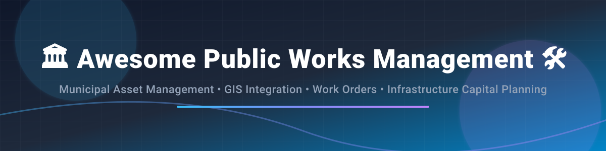

  

# 🏛️ Awesome Public Works Management 🛠️

     

## 📌 Top Public Works Management Platforms Ecosystem

**Curated List of SaaS Products & Open-Source GitHub Projects**

*Focused on Municipal Asset Management, Work Orders, GIS Integration, Infrastructure Maintenance, City Operations & Capital Planning*

**Last updated: September 2026**

---

This repository tracks notable **SaaS platforms** and **open-source software repositories** for **Public Works Management**, **Municipal Enterprise Asset Management (EAM)**, and **Computerized Maintenance Management Systems (CMMS)**. These systems empower local government agencies, cities, counties, and public works departments to efficiently manage municipal infrastructure assets (roads, traffic signals, parks, water utilities, facilities), work order scheduling, citizen service requests, field inspections, and long-term capital improvement planning—frequently powered by deep GIS (Geographic Information System) integrations.

**Industry Leader Examples**: Cityworks, Cartegraph, OpenGov Public Works, Asset Essentials, Brightly Confirm, Lucity, Infor Public Sector, MaintainX, UpKeep, and IBM Maximo.

**Open-source emphasis**: Specialized public-works and municipal asset platforms are largely commercial. Strong open-source options exist in general CMMS/EAM tools (**openMAINT**, **Odoo Maintenance**, **CMDBuild**, **Fiix Open Tools**, and emerging open-source maintenance platforms) that can support asset tracking and work-order workflows for public infrastructure.

Contributions welcome! Open a Pull Request (PR) to add or update entries. Keep descriptions factual, SEO-rich, and link to official sites or repositories.

---

## 📑 Table of Contents

- [🏢 SaaS & Commercial Hosted Platforms](#-saas--commercial-hosted-platforms)
- [🔓 Open-Source GitHub Projects](#-open-source-github-projects)
- [🛠️ Frameworks & Architecture for Custom Systems](#%EF%B8%8F-frameworks--architecture-for-custom-systems)
- [🤝 How to Contribute](#-how-to-contribute)
- [⚠️ Disclaimer](#%EF%B8%8F-disclaimer)
- [☕ Support & Sponsorship](#-support--sponsorship)
- [📈 Star History](#-star-history)

---

## 🏢 SaaS & Commercial Hosted Platforms

> **📊 Market Size & Industry Dynamics:**  
> The global Public Works & Municipal Enterprise Asset Management (EAM / CMMS) software market is estimated at **~$3.5 Billion – $5.0 Billion** (growing at ~8–10% CAGR). The market is **moderately fragmented**; while enterprise giants like IBM (Maximo) and Trimble (Cityworks) dominate large metropolitan agencies, specialized vendors (OpenGov, Brightly/Siemens, CentralSquare) and mobile-first disruptors (MaintainX, UpKeep) capture substantial regional and mid-market municipal market share.

| Product | Description | Company Size / Valuation (Parent) | Pricing (Starting Tier) | Free Tier / Trial Limits |
| :--- | :--- | :--- | :--- | :--- |
| **[IBM Maximo](https://www.ibm.com/products/maximo)** | Enterprise asset management platform widely used for complex infrastructure and public-sector asset programs. | **~$214B–$220B Market Cap** / ~$68B Revenue (IBM) | Credit-based AppPoints model (estimates starting around $164 per user/month) | 14-day free trial (includes access to Maximo Manage and Maximo Health with sample data) |
| **[Cityworks (Trimble)](https://www.cityworks.com/)** | Leading GIS-centric public works and asset management platform tightly integrated with Esri ArcGIS for infrastructure lifecycle management. | **~$13.4B Market Cap** / ~$3.7B Revenue (Trimble) | Annual subscription quotes (base deployments typically start around $1,995/yr - $50,000+/yr based on scale) | No free trial; custom interactive demos available upon request |
| **[Infor Public Sector](https://www.infor.com/)** | Enterprise solutions for public sector operations, including asset and work management capabilities. | **~$11B Valuation** / ~$3.4B Revenue (Koch / Infor) | Custom annual enterprise subscription quotes based on modules and user count | No free trial; tailored enterprise demos available |
| **[MaintainX](https://www.getmaintainx.com/)** | Modern mobile-first CMMS and work order platform used by both private and public organizations. | **~$2.5B Valuation** / >$135M ARR (Acquired by Autodesk) | $20 per user/month (Essential plan, billed annually) or $25/mo (monthly) | Free for life Basic plan (max 2 active repeating work orders, 1 month analytics) |
| **[Cartegraph (OpenGov)](https://www.cartegraph.com/)** | Municipal asset and operations management platform (now part of OpenGov) covering roads, parks, facilities, and related public works assets. | **~$1.8B Valuation** / ~$150M+ Revenue (OpenGov / Cox) | Custom annual subscription quotes (base subscriptions estimated from $1,499/user/yr) | No free trial; live customized demo sessions provided |
| **[OpenGov Public Works / EAM](https://opengov.com/)** | Government cloud platform that includes public works, asset management, work orders, and capital planning capabilities. | **~$1.8B Valuation** / ~$150M+ Revenue (OpenGov / Cox) | Custom enterprise quotes based on agency size and module selection | No free trial; personalized demos available for government agencies |
| **[Asset Essentials (Brightly)](https://www.brightlysoftware.com/)** | Cloud CMMS/asset management solution frequently used by public sector organizations for facilities and infrastructure maintenance. | **~$1.575B–$1.875B Valuation** / ~$250M–$500M Revenue (Brightly / Siemens) | Custom annual quotes (small deployments typically range from $100–$300/mo) | No free trial; guided product demos provided |
| **[Brightly Confirm](https://www.brightlysoftware.com/)** | Infrastructure asset management and investment planning tools within the Brightly portfolio. | **~$1.575B–$1.875B Valuation** / ~$250M–$500M Revenue (Brightly / Siemens) | Custom enterprise quotes based on asset volume and infrastructure scope | No free trial; scheduled product demonstrations available |
| **[Lucity (CentralSquare EAM)](https://www.lucity.com/)** | Public works management software for work orders, assets, and municipal operations. | **~$1B+ Est. Valuation** / ~$120M+ ARR (CentralSquare) | Custom enterprise quote-based pricing via CentralSquare Technologies | No free trial; customized software demonstrations offered |
| **[UpKeep](https://www.upkeep.com/)** | Asset and maintenance management platform with work order, preventive maintenance, and inventory features. | **~$48.7M Raised / Private** / ~$20M–$25M Revenue | $20 per user/month (Essential plan, billed annually) or $24/mo (monthly) | 7-day free trial (no credit card required; free unlimited view-only/requester users) |

---

## 🔓 Open-Source GitHub Projects

Below is a curated list of active open-source platforms, maintenance frameworks, and geospatial tools sorted by GitHub star count ⭐ (descending).

- **[Odoo](https://github.com/odoo/odoo)**   
  Comprehensive open-source ERP framework featuring modular **Odoo Maintenance**, equipment management, preventive scheduling, work order tracking, and inventory control.

- **[QGIS](https://github.com/qgis/QGIS)**   
  Leading open-source Desktop Geographic Information System (GIS) used extensively by municipal GIS departments for spatial public infrastructure mapping and asset attribute editing.

- **[Apache Superset](https://github.com/apache/superset)**   
  Modern open-source business intelligence and data visualization platform suitable for building municipal work order dashboards, maintenance KPI tracking, and asset condition reporting.

- **[PostGIS / PostgreSQL](https://github.com/postgres/postgres)**   
  Spatial database extension for PostgreSQL, forming the core geospatial data layer for open-source municipal asset registries and GIS-linked maintenance tools.

- **[MapServer](https://github.com/MapServer/MapServer)**   
  Open-source geographic data rendering engine for publishing spatial infrastructure layers, public works web maps, and GIS inspection maps.

- **[openMAINT](https://github.com/cmdbuild/cmdbuild)**   
  Open-source Enterprise Asset Management (EAM) and CMMS solution built on top of CMDBuild, tailored for managing municipal buildings, infrastructure assets, preventive maintenance, and work orders.

- **[ODK Collect / Open Data Kit](https://github.com/getodk/collect)**   
  Standard mobile data collection tool used by field inspectors for offline municipal asset condition surveys, road damage audits, and public works request capture.

- **[OpenL2M](https://github.com/openl2m/openl2m)**   
  Open-source management system for network infrastructure and physical layer asset tracking, useful for public utility and smart city telecom operations.

---

### 💡 Additional Open-Source Building Blocks

- **Facility & Infrastructure CMMS**: Leveraging **openMAINT** or **Odoo Maintenance** for municipal facilities and fleet maintenance operations.
- **Geospatial Infrastructure Registries**: Combining **PostGIS** and **QGIS** to build custom GIS-linked inventory databases for roads, pipes, signals, and trees.
- **Field Inspection Data Collection**: Deploying **ODK Collect (Open Data Kit)** for offline mobile field surveys by municipal inspectors.
- **Hybrid Municipal Tech Stack**: Using open-source components for lightweight tracking and specialized sub-departments alongside commercial platforms (Cityworks, Cartegraph, Brightly, IBM Maximo) for agency-wide public works operations.

---

## 🛠️ Frameworks & Architecture for Custom Systems

> **🚀 Blueprint for Open Municipal Management:**  
> 1. Deploy an open CMMS/EAM core (**openMAINT** or **Odoo**)  
> 2. Construct the municipal asset hierarchy (Roads ➔ Assets ➔ Components)  
> 3. Configure preventive maintenance schedules & work order routing  
> 4. Integrate geospatial layers using **PostGIS** & **QGIS**  
> 5. Connect mobile field inspection forms via **ODK Collect**  
> 6. Visualize operational KPIs and backlog status using **Apache Superset**  

---

## 🤝 How to Contribute

We welcome contributions from public works directors, GIS specialists, software engineers, and municipal IT teams! 

1. 🍴 **Fork** this repository.
2. 📝 Add or update entries in `README.md` following the standard table/list format.
3. 🔗 Include official link, factual 1–2 sentence description, and accurate company metrics / star counts.
4. 🚀 Submit a **Pull Request (PR)** with a clear title and summary.

Check out [Awesome-Awesome-Awesome](https://github.com/ishandutta2007/Awesome-Awesome-Awesome) for more curated lists!

---

## ⚠️ Disclaimer

- This list is **community-curated** for informational and educational purposes — it is not exhaustive and does not constitute an official endorsement.
- Public works management software handles critical municipal infrastructure data and public safety workflows. Always evaluate security, compliance, access controls, data backup, and vendor SLAs before deployment.

---

## ☕ Support & Sponsorship

If you find this public works management repository helpful, please consider supporting the project!

- ⭐ **Star** this repository to increase visibility.
- 🔀 **Fork** and share it with municipal tech teams and public sector peers.
- ☕ **Buy me a coffee / Sponsor**: If you'd like to support ongoing curation and open-source updates, consider sponsoring via the [GitHub Sponsor Dashboard](https://github.com/sponsors/ishandutta2007).

Thank you for helping keep public infrastructure well-maintained, data-driven, and accessible! ❤️

---

## 📈 Star History

